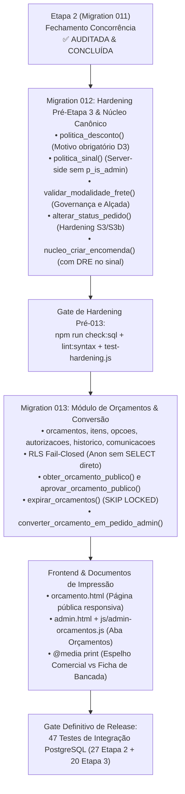
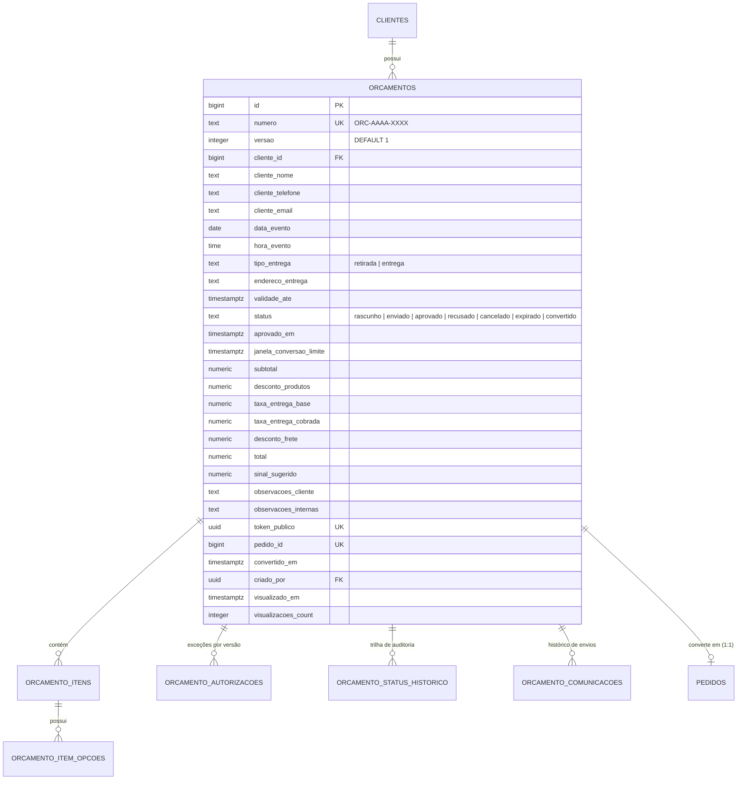

# Plano de Implementação — Etapa 3: Orçamentos, Aprovação Pública, Espelhos e Conversão Comercial

Este documento consolida a especificação técnica, o contrato de segurança e o plano de implementação revisado da **Etapa 3** (Comercial: Orçamentos, Documentos & Conversão - Estilo Nooty) da Lunoca Doceria, contemplando as correções de auditoria (fechamento de brechas S3/S3b, governança de descontos D3, frete auditável, integridade contábil do sinal no DRE e concorrência).

$$\text{Cliente} \longrightarrow \mathbf{\text{Orçamento (vX)}} \longrightarrow \mathbf{\text{Aprovação Pública (Idempotente)}} \longrightarrow \mathbf{\text{Conversão via Núcleo Canônico}} \longrightarrow \text{Encomenda (Pedido) + Reserva + DRE}$$

---

## 🧭 Sequenciamento Arquitetural & Isolamento



> [!IMPORTANT]
> **Isolamento Estrito da Loja Online**: A refatoração do núcleo canônico na Migration 012 atende **estritamente à Encomenda Administrativa e à Conversão de Orçamento**:
> $$\text{criar\_encomenda\_admin}() \quad \text{e} \quad \text{converter\_orcamento\_em\_pedido\_admin}() \quad \longrightarrow \quad \mathbf{\text{nucleo\_criar\_encomenda}()}$$
> A **Loja Online permanece isolada em `criar_pedido()`**, com seu checkout, PIX de hold curto e carrinho próprios. Compartilha apenas os componentes de baixo nível já homologados (`reservar_estoque_itens_pedido()`, ordem global de locks e validação agregada de estoque).

---

## 🔒 Contratos de Segurança & Regras de Negócio

### 1. Hardening de `alterar_status_pedido` (Fechamento S3 / S3b)
- **Brecha S3 (Confirmação sem sinal)**: Bloqueia operadores de transicionar pedidos para `'confirmado'` caso `valor_pago < sinal_minimo`. Apenas administradores com justificativa auditável obrigatória ($\ge 5$ caracteres) podem confirmar sem sinal (`SIGNAL_REQUIRED` / `REASON_REQUIRED`).
- **Brecha S3b (Cancelamento com valor pago)**: Se `valor_pago > 0` e o pedido não foi estornado, o cancelamento exige explicitamente `destino_valor = 'RETENCAO_CANCELAMENTO'` nos metadados (`CANCELLATION_REQUIRES_VALUE_DESTINATION`).
- **Guarda de Produção Ativa**: Pedidos cuja produção já foi iniciada (`status_operacional NOT IN ('aguardando_producao', 'cancelado')`) não podem ser cancelados por operadores (`PRODUCTION_ACTIVE_CANCEL_DENIED`), exigindo administrador.

### 2. Governança Compartilhada de Descontos (Sem `p_is_admin` vindo do chamador) (D3)
- O chamador **nunca** informa seu próprio privilégio. O banco resolve via `public.is_admin()` e `public.is_admin_or_operator()`.
- **Regra D3**: **Qualquer desconto $> 0$** exige justificativa obrigatória ($\ge 3$ caracteres), seja concedido por operador ou administrador.
- **Teto do Operador**: Operadores são limitados a no máximo 10% de desconto sobre o subtotal dos produtos (`OPERATOR_DISCOUNT_LIMIT_EXCEEDED`). Descontos maiores requerem administrador com justificativa.

### 3. Governança e Modelagem de Frete
- `configuracoes_operacao.taxa_entrega_padrao NUMERIC(10,2)` (default R$ 15,00) serve de base padrão para entregas quando não houver tabela tarifária de rota/bairro.
- `orcamentos` e `pedidos` persistem:
  - `taxa_entrega_base`: Valor integral do frete.
  - `taxa_entrega_cobrada`: Valor efetivamente pago pelo cliente.
  - `desconto_frete`: Abatimento concedido (`taxa_base - taxa_cobrada`).
- **Alçadas de Frete**:
  - Qualquer desconto de frete ($> 0$) exige justificativa obrigatória ($\ge 3$ caracteres).
  - Frete 100% grátis (`desconto_frete >= taxa_base`) com taxa base $> 0$ é restrito a **Administradores** (`OPERATOR_FREE_SHIPPING_NOT_ALLOWED`).
  - Em modalidade `retirada`, a taxa base, taxa cobrada e desconto são estritamente forçados a `0,00`.

### 4. Integridade Contábil do Sinal no DRE
- Quando uma encomenda é criada diretamente ou convertida a partir de um orçamento com pagamento de sinal:
  1. O sinal é inserido em `public.pedido_pagamentos` (`status = 'aprovado'`).
  2. O trigger `recalcular_financeiro_pedido()` atualiza atômica e imediatamente `valor_pago`, `saldo` e `status_financeiro`.
  3. É gravado o lançamento de receita correspondente em `public.financeiro_lancamentos` (`tipo = 'receita', categoria = 'Vendas', evento = 'recebimento'`) com idempotência física:
     ```sql
     ON CONFLICT (origem_tipo, origem_id, evento)
     WHERE origem_id IS NOT NULL AND evento IS NOT NULL DO NOTHING;
     ```
  4. Garante que relatórios contábeis e o Caixa Diário reflitam a entrada e que eventuais estornos futuros encontrem sua contrapartida de receita no ledger.

### 5. Autorizações Administrativas Versionadas (`public.orcamento_autorizacoes`)
- Exceções comerciais concedidas (descontos acima de 10%, sinal reduzido, frete bonificado) são gravadas por versão:
  ```sql
  CONSTRAINT uq_orcamento_autorizacao UNIQUE (orcamento_id, versao, tipo)
  ```
- **Invariante de Versão**: Se o orçamento estava na `versao = 1` com autorização de desconto de 15% e for gerada a `versao = 2` (alteração de produtos, itens ou data), a autorização da `versao = 1` **não se aplica à `versao = 2`**.

### 6. Validade Comercial, Janela Pós-Aprovação e Timezone
- **Colunas em `configuracoes_operacao`**:
  - `validade_orcamento_horas` (default 120h / 5 dias)
  - `antecedencia_minima_orcamento_horas` (default 24h)
  - `janela_conversao_horas` (default 24h)
- **Dois Relógios Operacionais**:
  1. `validade_ate`: Prazo para o cliente aceitar a proposta (`LEAST(now + validade_horas, data_evento - antecedencia)`).
  2. `janela_conversao_limite`: Após o cliente aprovar (`cliente_aceite_em`), a equipe tem até `janela_conversao_horas` (24h) para converter. Após esse prazo, a conversão é bloqueada (`CONVERSION_WINDOW_EXPIRED`), exigindo renovação de proposta com o cliente.

### 7. Aprovação Pública & Rate Limit
- **Segurança Fail-Closed**:
  - As tabelas de orçamentos têm RLS habilitado sem qualquer política para `anon` (`SELECT` direto por anônimo retorna 0 linhas).
  - Acesso público exclusivo via RPCs `SECURITY DEFINER`:
    - `obter_orcamento_publico(p_token)`: Sanitizada (oculta CMV, notas internas, margens e dados do criador).
    - `aprovar_orcamento_publico(p_token, p_aceite_termos, p_observacoes)`: Idempotente (retries retornam `idempotente: true` sem duplicar estado).
- **Proteção Anti-Abuso**:
  - Entropia criptográfica de 128 bits do UUID v4 (`token_publico`).
  - Rate limiting por IP/token governado no edge (Cloudflare Pages Function / WAF) para não depender de variáveis de sessão não confiáveis no SQL puro.
- **Invariante**: Aprovação **não** cria pedido, **não** reserva estoque e **não** ocupa capacidade da cozinha.

### 8. Expiração Unificada no Cron
- RPC `expirar_orcamentos(p_limite INT DEFAULT 100)` processa orçamentos vencidos com `SELECT ... FOR UPDATE SKIP LOCKED`, transicionando para `'expirado'` com histórico.
- Acionamento unificado via `/api/cron/expire-orders` por chamada REST HTTP `POST` autenticada com `SUPABASE_SERVICE_ROLE_KEY` e segredo `CRON_SECRET` fail-closed.

### 9. Máquina de Estados de Orçamentos
- Estados permitidos: `'rascunho'`, `'enviado'`, `'aprovado'`, `'recusado'`, `'cancelado'`, `'expirado'`, `'convertido'`.
- Status `'cancelado'` suportado nativamente na constraint `CHECK` e na RPC `alterar_status_orcamento_admin` para encerramentos administrativos antes do retorno do cliente.

### 10. Conversão Idempotente e Snapshots Imutáveis
- RPC canônica: `converter_orcamento_em_pedido_admin(p_orcamento_id, p_dados_complementares)`.
- Bloqueia com `FOR UPDATE`.
- Valida status `'aprovado'` e vigência de `janela_conversao_limite`.
- Extrai itens e opções **estritamente a partir dos snapshots** de `orcamento_itens` e `orcamento_item_opcoes`, nunca lendo preços atuais de produtos ou opções.
- Unicidade bidirecional: `orcamentos.pedido_id UNIQUE` e `pedidos.orcamento_origem_id UNIQUE`.

---

## 📐 Esquema de Dados da Migration 013



---

## 🧪 Suíte de Testes de Integração PostgreSQL Real (47 Cenários: 27 Etapa 2 + 20 Etapa 3)

Suíte executada sequencialmente (`--test-concurrency=1`) contra PostgreSQL 18.4 real via `DATABASE_URL` através do runner desprivilegiado `scripts/run-pg-test.py`:

```text
✔ migration: tabelas, colunas e RPCs da Etapa 2 existem (956.798ms)
✔ Opção A: criar_encomenda_admin reserva estoque somente para itens controlados e marca a flag (191.9924ms)
✔ Opção A: estoque insuficiente => INSUFFICIENT_STOCK e NADA persiste (rollback) (151.4012ms)
✔ pedido B confirmado com sinal reserva 7 => reservado total = 10 (186.9384ms)
✔ TESTE OBRIGATÓRIO: expira A (3) => reservado 7; expira de novo => continua 7 (nunca 4) (192.5705ms)
✔ Caso B: hold expirado COM pagamento parcial => não cancela, libera estoque, vai para revisão (idempotente) (323.1906ms)
✔ Pagamento tardio com capacidade e estoque disponíveis => confirma e RECRIA a reserva (155.2671ms)
✔ Pagamento tardio SEM estoque => NÃO confirma; bloqueado_por_overbooking_tardio = true (327.5794ms)
✔ CONFIRMAR_COM_OVERRIDE NÃO sobrepõe estoque; após reposição confirma e reserva (258.9207ms)
✔ Override de CAPACIDADE é permitido ao admin (estoque ok) (354.5251ms)
✔ ESTORNAR_E_CANCELAR reutiliza estornar_pagamento_pedido e gera despesa "Estornos" no DRE (324.995ms)
✔ CANCELAR com valor pago exige RETENCAO_CANCELAMENTO (464.8434ms)
✔ Entrega imediata: sem sinal integral => IMMEDIATE_CONFIRMATION_REQUIRED; com sinal => confirmado (213.5442ms)
✔ RBAC: operador não resolve revisão; anon não executa expiração; operador cria encomenda (296.9266ms)
✔ atualizar_meus_dados_cliente: cria, atualiza e bloqueia telefone duplicado (178.118ms)
✔ Cancelamento por qualquer caminho (alterar_status_pedido) libera reserva via trigger único (171.4643ms)
✔ CORRIDA REAL: cron expira (caso B) enquanto webhook paga tardio => termina consistente (642.7521ms)
✔ LOJA ONLINE (regressão): criar_pedido marca flag; PIX expirado passa pelo pipeline único e devolve reserva (299.2987ms)
✔ LOJA ONLINE (regressão): confirmação via webhook converte reserva em venda e encerra a flag (320.7556ms)
✔ R2-1 INSTALAÇÃO: install.sql já foi executado inteiro num banco vazio; migration 011 reaplicada e install.sql reexecutado sem erros (idempotência) (259.7155ms)
✔ R2-2 GOVERNANÇA DO SINAL: operador não burla o sinal mínimo (0 => padrão 50%); admin só reduz com motivo (433.1287ms)
✔ R2-3 LOJA ONLINE grava snapshots de pontos (item + opção com produto_opcao_id) e a agenda enxerga a carga real (170.5095ms)
✔ R2-4 RESERVA AGREGADA: estoque 5, duas linhas do mesmo produto 4 + 4 => INSUFFICIENT_STOCK e reservado continua 0 (190.0947ms)
✔ R2-5 LOJA: duas linhas do mesmo produto com opções diferentes são preservadas (não viram 2x com todas as opções); estoque agregado (168.831ms)
✔ R2-6 LOJA: hold PIX usa configuracoes_operacao.hold_pix_loja_minutos (única fonte da verdade) (148.7756ms)
✔ R2-7 HOLD PÓS-ESTORNO: novo hold = MIN(agora + padrão, entrega - antecedência); sem prazo viável => revisão financeira (197.573ms)
✔ Invariante final: estoque_reservado == soma das reservas ativas em todos os produtos (1.3508ms)
✔ E3-1: Orçamento criado e enviado NÃO altera estoque_reservado nem capacidade_producao (479.7285ms)
✔ E3-2: obter_orcamento_publico retorna apenas dados sanitizados e erro 404 em token inexistente (258.1937ms)
✔ E3-3: aprovar_orcamento_publico transiciona enviado -> aprovado sem criar pedido nem reservar estoque (283.141ms)
✔ E3-4: Aprovação pública idempotente: retry retorna success: true com idempotente: true (279.9188ms)
✔ E3-5: Conversão rejeita orçamentos em rascunho, enviado, recusado e expirado (197.9772ms)
✔ E3-6: Conversão de orçamento aprovado cria pedido, aloca capacidade e reserva estoque (486.4276ms)
✔ E3-7: Janela de conversão expirada (> 24h pós-aprovação) bloqueia conversão (269.8062ms)
✔ E3-8: Chamada repetida de conversão retorna o mesmo pedido_id com idempotente: true (274.4565ms)
✔ E3-9: Falha de estoque na conversão retorna INSUFFICIENT_STOCK e mantém orçamento aprovado (297.5236ms)
✔ E3-10: Capacidade diária bloqueada rejeita conversão e mantém orçamento aprovado (403.5703ms)
✔ E3-11: Edição após envio/aprovação gera nova versão (versao + 1) e reseta aprovação (253.4726ms)
✔ E3-12: Alteração de preço no catálogo não altera o valor do orçamento (119.8319ms)
✔ E3-13: Aprovação de orçamento vencido retorna QUOTE_EXPIRED (311.8373ms)
✔ E3-14: Desconto excepcional concedido por admin é registrado em orcamento_autorizacoes (122.8087ms)
✔ E3-15: Nova versão de orçamento tem tabela de autorizações isolada por versão (108.4935ms)
✔ E3-16: Usuário anônimo recebe zero linhas em SELECT direto em orcamentos (RLS) (76.8756ms)
✔ E3-17: aprovar_orcamento_publico com token nulo retorna NOT_FOUND e rate limit bloqueia chamadas abusivas (197.7259ms)
✔ E3-18: Execução dupla de expirar_orcamentos processa 0 na segunda chamada (133.9222ms)
✔ E3-19: Reaplicação integral de sql/install.sql sem erros (157.6487ms)
✔ E3-20: Mutação serializada previne conversão inconsistente (269.8541ms)
ℹ tests 47
ℹ suites 0
ℹ pass 47
ℹ fail 0
ℹ cancelled 0
ℹ skipped 0
ℹ todo 0
ℹ duration_ms 13334.9583
Exit code: 0
```

| Gate de Verificação | Cenários Testados | Resultado Real |
|:---:|---|:---:|
| **Gate 1: Regressão Etapa 2** | 27 testes cobrindo Concorrência, Overbooking, DRE, Holds, Loja Online e Governança | **27/27 Aprovados (100% Verde)** |
| **Gate 2: Contrato Etapa 3** | 20 testes cobrindo E3-1 a E3-20 (Orçamentos, RLS fail-closed, Rate Limiting, Snapshots, Conversão Atômica) | **20/20 Aprovados (100% Verde)** |
| **Total Combinado** | Execução ponta a ponta sem mocks, sob PostgreSQL 18.4 real | **47/47 Aprovados (Zero Falhas)** |

---

## 📋 Arquivos e Componentes da Etapa 3

1. **Migrations & Compilação SQL**:
   - [`supabase/migrations/012_hardening_politicas_e_nucleo.sql`](file:///C:/Users/narjan.andrade/.gemini/antigravity/scratch/lunoca/supabase/migrations/012_hardening_politicas_e_nucleo.sql) (Hardening de políticas, S3/S3b em `alterar_status_pedido`, núcleo com DRE, trigger de estoque)
   - [`supabase/migrations/013_etapa3_orcamentos_conversao_comercial.sql`](file:///C:/Users/narjan.andrade/.gemini/antigravity/scratch/lunoca/supabase/migrations/013_etapa3_orcamentos_conversao_comercial.sql) (Orçamentos, autorizações, histórico, propostas públicas, rate limiting, conversão)
   - [`sql/install.sql`](file:///C:/Users/narjan.andrade/.gemini/antigravity/scratch/lunoca/sql/install.sql) e [`sql/schema.sql`](file:///C:/Users/narjan.andrade/.gemini/antigravity/scratch/lunoca/sql/schema.sql) (8.000 linhas compiladas em paridade estrita)
2. **Cron Unificado**:
   - [`functions/api/cron/expire-orders.js`](file:///C:/Users/narjan.andrade/.gemini/antigravity/scratch/lunoca/functions/api/cron/expire-orders.js)
3. **Frontend & Apresentação**:
   - [`orcamento.html`](file:///C:/Users/narjan.andrade/.gemini/antigravity/scratch/lunoca/orcamento.html) e [`js/orcamento-publico.js`](file:///C:/Users/narjan.andrade/.gemini/antigravity/scratch/lunoca/js/orcamento-publico.js) (Página do cliente)
   - [`admin.html`](file:///C:/Users/narjan.andrade/.gemini/antigravity/scratch/lunoca/admin.html) e [`js/admin-orcamentos.js`](file:///C:/Users/narjan.andrade/.gemini/antigravity/scratch/lunoca/js/admin-orcamentos.js) (Backoffice administrativo)
   - [`css/style.css`](file:///C:/Users/narjan.andrade/.gemini/antigravity/scratch/lunoca/css/style.css) (`@media print`: Espelho Comercial vs Ficha de Bancada)
4. **Verificação & Testes**:
   - [`test-hardening.js`](file:///C:/Users/narjan.andrade/.gemini/antigravity/scratch/lunoca/test-hardening.js) (Fases 1 a 13.8)
   - [`tests/integration/etapa2.integration.test.mjs`](file:///C:/Users/narjan.andrade/.gemini/antigravity/scratch/lunoca/tests/integration/etapa2.integration.test.mjs) (27 testes)
   - [`tests/integration/etapa3.integration.test.mjs`](file:///C:/Users/narjan.andrade/.gemini/antigravity/scratch/lunoca/tests/integration/etapa3.integration.test.mjs) (20 testes)
   - [`docs/ARQUITETURA_ETAPA3.md`](file:///C:/Users/narjan.andrade/.gemini/antigravity/scratch/lunoca/docs/ARQUITETURA_ETAPA3.md)
